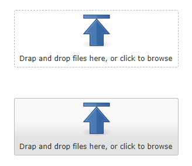

<!-- PROJECT LOGO -->
<br />
<p align="center">
  <a href="https://github.com/sqville/ville.Upload">
    
  </a>
  <h3 align="center"></h3>
  <p align="center">
    A control for the Qooxdoo JavaScript Framework
  </p>
</p>
<!-- ABOUT THE PROJECT -->

## About The Project

**ville.Upload** is a [Qooxdoo](https://qooxdoo.org/) control designed to enabled browser drag and drop features for the qx.ui.form.FileSelectorButton control.

**Benefits**
* Typical drag and drop upload control look and feel
* Use external CSS files or embedded CSS (commented code example included) for the dragover event look and feel
* Easily revert back to the standard button look and feel by simply setting the controls appearance property to "button" 

**Screen Shot**


<!-- GETTING STARTED -->
## Using the Control in your Application
To use the control in your application, go into the application root directory and install the library into your project:
```sh
$ qx package update
$ qx package list
$ qx package install sqville/ville.Upload
```
**APPROACH**

<!-- DEMO -->
## Demo
See this control in action using the ville [Wax Demo App](http://qooxdoo.org/qxl.packagebrowser/qxl.packagebrowser/demos/sqville/ville.Embed/waxdemo/)
<!-- ROADMAP -->
## Roadmap
None. This is a straight forward solution. Reach out to the author if you feel that something is missing.
<!-- LICENSE -->
## License
Distributed under the MIT License. See `LICENSE` for more information.

<!-- CONTACT -->
## Contact
Chris Eskew - [@SQville](https://twitter.com/SQville) - email: sqville@gmail.com